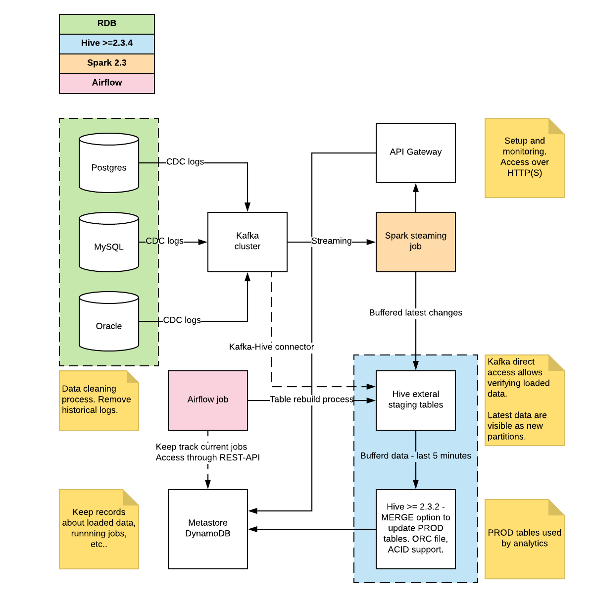

# cdc-replication-hadoop
Keep in sync RDB schema (Oracle, MySQL, Postgres) with Hive structured store. Added Kafka as a buffer between those tables. CDC (Change Data Capture) is one of the best ways to interconnect an OLTP database system with other systems like Data Warehouse, Hive or Spark.

## Purpose 
The purpose of this project is to create a solution that gives you the ability to synchronize RDB (MySQL, Oracle, Postgres) tables with Hive equivalents. Synchronization process should be done by using CDC (change data capture) logs. By using this technique we should get almost real-time synchronization between source and destination table. For the CDC logging purposes, Debezium’s MySQL Connector was used. It can monitor and record all of the row-level changes in the databases on a MySQL server.

*Note: We assume that we don't want to keep history in hive tables. Hive tables should constantly follow RDB.* 

## Requirements
* RDB changes are sent over CDC logs
* Kafka buffer to keep CDC logs in small chunks
* Hive 2.3.2 with ACID support
* Spark 2.3
* OrcFile format
* Terraform scripts for GCP cluster spinup
* Metastore table for keeping logs about current processes running. Accessed to it is over AWS API-Gateway. DynamoDB used as a data storage layer.
* [MySQL Debezium connector to Kafka](https://debezium.io/docs/connectors/mysql/)
* [Airflow scheduler](https://airflow.apache.org/index.html)

## Diagram

The diagram below shows the architecture concept. There are three main parts presented below:
* Relational database cluster, configured to generate CDC logs. 
* Logs are sent to the Kafka buffer 
* Spark streaming job lets to get raw data and push (in a structured way) to the Hive staging table
* Merge process is done in Hive. To make it work we need to use transaction support in hive.

## App

* **Debezium** - MySQL Connector can monitor and record all of the row-level changes in the databases on a MySQL server or HA MySQL cluster. The first time it connects to a MySQL server/cluster, it reads a consistent snapshot of all of the databases. When that snapshot is complete, the connector continuously reads the changes that were committed to MySQL 5.6 or later and generates corresponding insert, update and delete events. All of the events for each table are recorded in a separate Kafka topic, where they can be easily consumed by applications and services.
> [MySQL connector configuration](https://debezium.io/docs/connectors/mysql/)
> [Debezium kafka setup](https://debezium.io/docs/tutorial/)

* Kafka configuration 
* 

## Tests
Tests have been planned and executed on the Google Cloud. The environment was prepared by using  [terraform scripts](https://github.com/jwszolek/hive-cdc-orcfile/tree/master/terraform-gcp).

## Links
